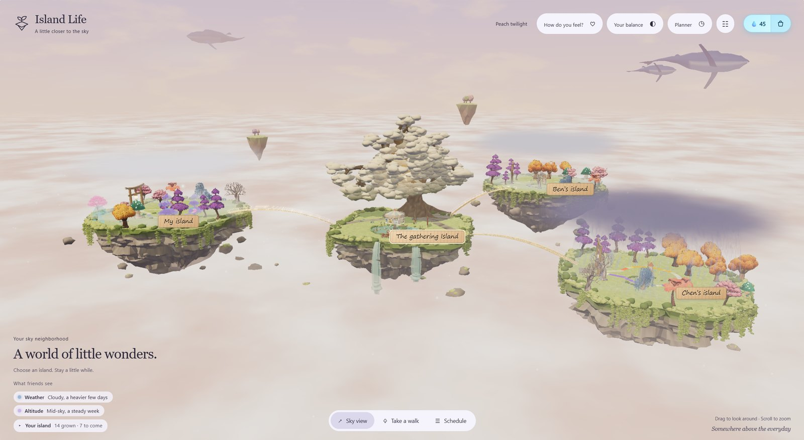
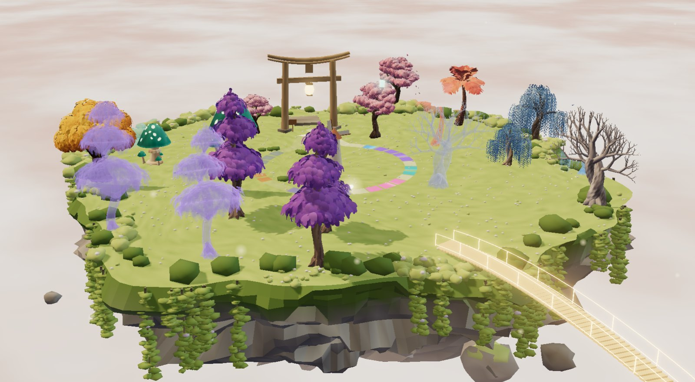
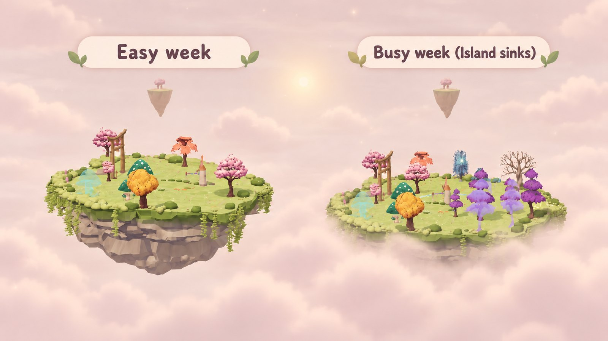
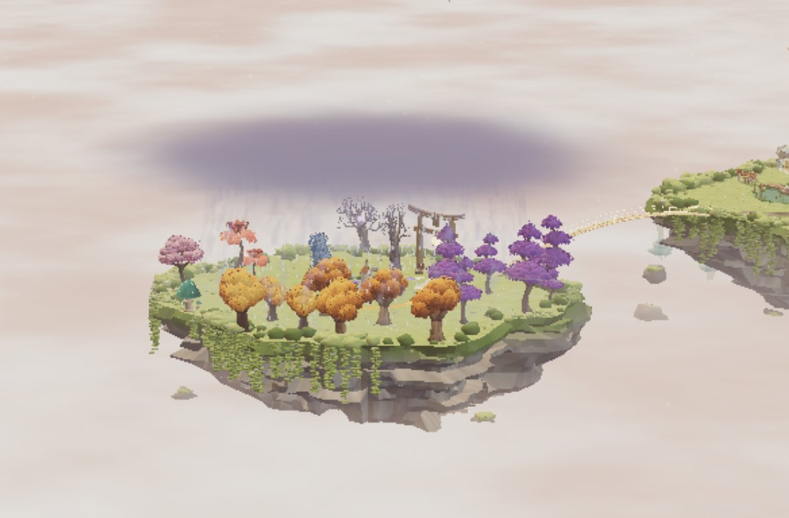
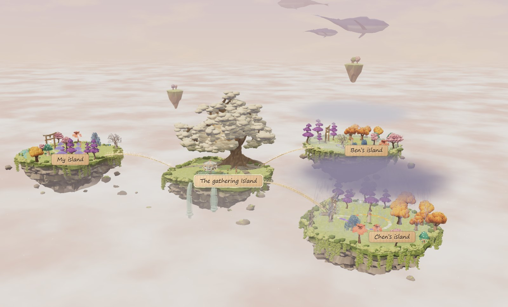
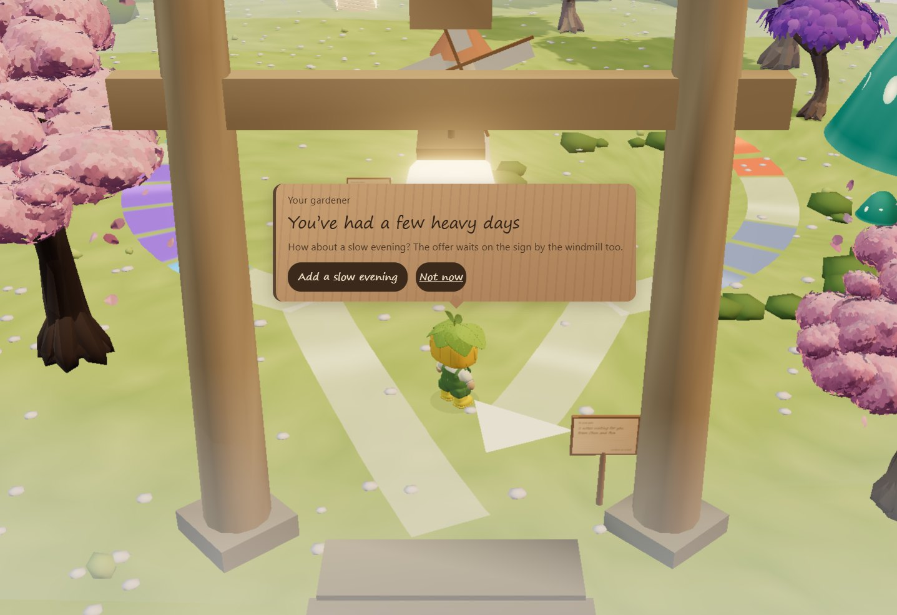
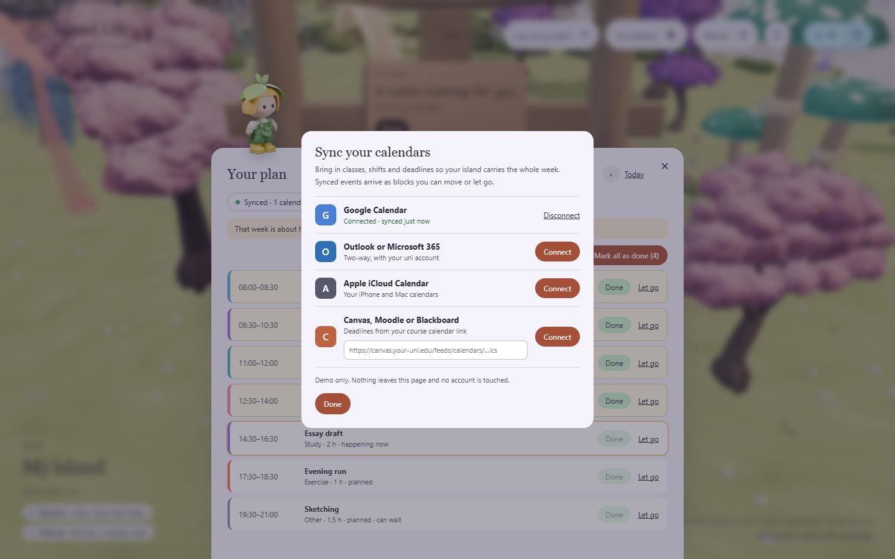

# Island Life

**Your week, grown into an island in the sky.**



> **Live demo:** _add the Vercel link here_ · **Team:** _add names here_ · Made for the *Beating the Burnout* track.

Burnout rarely comes from one big thing. It comes from everything piling up until you're running on empty, and nobody noticed, including you.

Island Life turns your week into a small floating island, so you can see the pile before it gets heavy. You can read your whole week in one glance, without a single chart. And it doesn't wait for you to look. It reads your plan and your check-ins, and speaks up with suggestions made for your week.

---

## Your week, as an island

<table>
<tr>
<td width="50%"></td>
<td width="50%"></td>
</tr>
<tr>
<td valign="top"><h3>Everything you do grows into a tree</h3>
Seven kinds of activity, seven kinds of tree. What's coming up stands as a glass tree. Mark it done, and it takes root in full colour. Let it go, and the glass tree drifts away quietly.</td>
<td valign="top"><h3>A full week sinks your island</h3>
Your island floats high when your week has room, and sinks toward the clouds as you take more on. You feel it's too much before you've said yes to one more thing.</td>
</tr>
<tr>
<td></td>
<td></td>
</tr>
<tr>
<td valign="top"><h3>Your feelings become the weather</h3>
Tell your island how you feel, and a coloured lantern rises into its sky. A few tired, stressed or low days gather cloud, then rain. Calm and happy days clear it again.</td>
<td valign="top"><h3>Your friends are a bridge away</h3>
Friends' islands connect to yours through The gathering Island. You see their weather and how high they float, never their hours or plans. A rainy island is your cue to leave a note at their gate.</td>
</tr>
</table>

|  |  |  |  |  |  |  |
|:---:|:---:|:---:|:---:|:---:|:---:|:---:|
| Study | Work | Errands | Social | Exercise | Rest | Other |

The same little trees mark each kind of activity everywhere in the app, so you can spot a study-heavy week from across the sky.

---

## A nudge before you burn out

Burnout creeps up, so Island Life watches for it. When your check-ins keep coming back tired, stressed or low, or your week gets too full, it nudges you on its own, with a way to unwind picked from your own week.

<table>
<tr>
<td width="50%"></td>
<td width="50%"></td>
</tr>
<tr>
<td valign="top"><b>Your gardener speaks up.</b> After a run of tired, stressed or low days, your gardener notices the moment you get home and suggests a way to unwind: tea with the friend you've seen least, a walk if you've barely moved, an early night after late ones, or a slow evening. It has already found a free time. One tap puts it on your plan, or ask for another idea.</td>
<td valign="top"><b>Your week, in balance.</b> Time, mental, physical, social and errands, each read from your week and put in plain words. Next to them are changes made for you, like pushing the two blocks you marked "can wait" to next week. Each one applies in one tap.</td>
</tr>
</table>

---

## And the little moments

<table>
<tr>
<td></td>
<td></td>
</tr>
<tr>
<td valign="top"><b>The golden window.</b> Once a day, everyone gets two minutes to share one photo of right now. The photos hang on the carousel on The gathering Island, and the day's album keeps them all.</td>
<td valign="top"><b>Small things, together.</b> Anyone can post a small task, like a walk outside or an evening with no screens. You earn more when friends finish too.</td>
</tr>
</table>

- **Today is a path.** Your day is a glowing path laid out like a clock face, and a little light walks it in real time.
- **Notes wait at your gate.** Friends leave a few words on a wooden sign, and you read them when you get home.
- **A planner that feels normal.** Day, week and month views, with drag to add and move, Done, and a guilt-free Let go.
- **Dewdrops.** Small rewards for finishing things, resting and showing up for friends. You spend them on garden props and lanterns.

---

## Design choices

- **No streaks, no guilt.** Letting go of a plan is fine. Its glass tree drifts away and stops counting this week. You can bring it back any time.
- **It rewards balance, not hustle.** A finished rest block earns the same as a finished study block.
- **Private by default.** Friends see your weather and how high you float, in words. Your hours, plans and check-ins stay yours. For each block, you choose whether friends see the whole thing, only its kind and size, or nothing.

---

## How it works

One element means one thing, always.

| In the world | What it means | What drives it |
|---|---|---|
| **Altitude** | How full your week is | Planned hours this week against what you can give. Very full weeks sit just above the cloud sea. |
| **Weather** | How you've been feeling | Your check-ins this week, with recent days counting for more. Tired, stressed and low bring cloud and rain. Calm and happy clear it. |
| **Glass trees** | What's coming up | Future blocks, one species per kind of activity |
| **Solid trees** | What you did | A block you marked Done. Nothing grows on its own. |
| **Glowing path** | Today's timetable | Your blocks from 07:00 to 22:00, laid out like a clock face |
| **The light on the path** | Right now | It walks the path in real time |
| **Lanterns in your sky** | Your feelings | Each check-in you make this week |
| **Bridge glow** | Warmth with your friends | Notes, shared moments and time together |
| **Carousel photos** | The day's shared moments | One photo per person from the golden window, plus moments through the day |
| **Dewdrops** 💧 | A gentle reward | Done blocks, notes, moments and group tasks |

**Rebalancing** happens in three places:
- **The planner**, where you move, resize, finish or let go of blocks.
- **The balance page**, which suggests small changes you apply in one tap.
- **Your gardener**, who spots a run of heavy days or a very full week and suggests a way to unwind that fits it, with a sign by the windmill keeping the offer.

---

## Plans for the next stage

- **Calendar sync.** Your classes, shifts and deadlines would land on your island without retyping. The planner already shows the connect flow as a demo. The real connections would use:
  - **Google Calendar** through the Google Calendar API, two-way;
  - **Outlook and Microsoft 365** through Microsoft Graph, two-way, which covers most university accounts;
  - **Apple iCloud Calendar** through CalDAV;
  - **Canvas, Moodle and Blackboard** through the calendar feed link (ICS) each one already exports;
  - **Google Classroom** through the Classroom API, for coursework due dates.

  
- **Adding a mobile version.** A lighter island, compressed models and one-thumb controls, so your island fits in your pocket.
- **Real accounts and friends.** A backend, invites and live weather between friends.
- **Gentle milestones.** Your island would celebrate things like a first week in balance or a first slow evening.

---

## Try it

**Online:** _add the Vercel link here_. There's no account to create: press **Try the demo island**, or use any email.

| Do this | How |
|---|---|
| Walk | <kbd>W</kbd> <kbd>A</kbd> <kbd>S</kbd> <kbd>D</kbd> or the arrow keys |
| Jump | <kbd>Space</kbd> |
| Use what's in front of you | <kbd>E</kbd>, or click the card |
| Back to the sky view | <kbd>Esc</kbd> |
| Look around | Drag, and scroll to zoom |
| See the sinking and the rain | Open **Tune the world** (☷) and drag an island's altitude or weather |
| Hear from your gardener | Visit your island. The demo has had a few heavy days, so your gardener speaks up on arrival, and the sign by the windmill keeps the offer. |

**Handy links for demos:** add `?skiplogin` to skip the landing page. Add `?island=sakura` to land straight on your island, or use `oak` for Chen's and `purple` for Ben's.

Everything works from the keyboard, focus is always visible, controls are labelled, and motion follows your reduced-motion setting.

**Run it locally:**

```bash
npm install
npm run dev      # http://127.0.0.1:5173
npm run build    # production build in dist/
```

**Deploy on Vercel:** use the Vite preset, the build command `npm run build`, and the output folder `dist`.

---

## Built with

- **[Three.js](https://threejs.org/)** for the world, and **[Vite](https://vite.dev/)** for the build.
- **Blender**, driven by Python scripts, for every island, tree, character, icon and the landing art. The generators are in `models/` and `tools/`.
- **Playwright** for headless checks of the scene.
- Plain JavaScript and CSS, with no UI framework.

<details>
<summary>Where things live</summary>

| File | What it does |
|---|---|
| `src/main.js` | The scene, camera, islands, bridges and walking |
| `src/life.js` | Connects the world to the app: gates, notes, check-ins, the gardener's nudge |
| `src/data.js` | Mock members, categories, moods, and how load and weather are worked out |
| `src/plan.js` | The plan store for blocks, done, let go and moving |
| `src/calendar.js` | The planner, including the demo calendar sync |
| `src/balance.js` | The balance page: areas, mix, feelings, progress and suggestions |
| `src/timetable.js` | The clock-face path and its stops |
| `src/mood.js`, `src/photos.js` | Feeling lanterns and the photo carousel |
| `src/login.js` | The landing page with its walkable signposts |

</details>

## Credits

- **Photos** in the shared moments are from [Unsplash](https://unsplash.com/), used under the Unsplash licence.
- **3D models, icons and the character** were made by the team in Blender.
- **Fonts** are Georgia and Segoe UI, from the system. The handwritten signs use the system's handwriting font.
