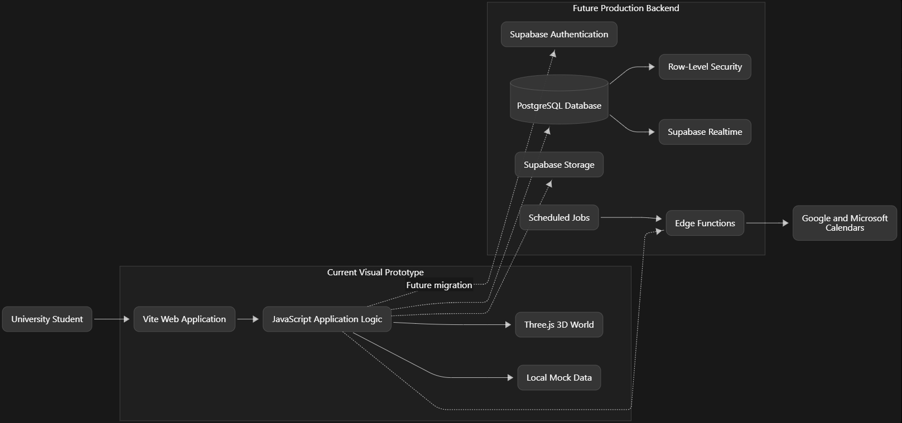

# Island Life

<p align="center">
  <a href="docs/videos/hero.mp4"></a>
  <br/><br/>
  <a href="docs/videos/hero.mp4"></a>
  <br/><sub>Your sky neighbourhood, a full turn &nbsp;·&nbsp; <a href="docs/videos/hero.mp4">full clip</a></sub>
  <br/><br/>
  <a href="docs/videos/character.mp4"></a>
  <br/><sub>Crossing to The gathering Island &nbsp;·&nbsp; <a href="docs/videos/character.mp4">full clip</a></sub>
</p>

**Team:** Codenected  
**Team Member:** Lee Kai Hong, Leow Shen En, Choong Zhuo Lin, Chung Jun  
**Problem Statement:** Stress & Workload Manager

## Project Links

- **Video Presentation:** _To be added_
- **Presentation Slides:** _To be added_
- **Prototype:** [Island Life Prototype](https://island-life-one.vercel.app/)


# 1. Project Overview

## 1.1 Problem

Today’s university students live in a state of continuous overcommitment, constantly striving to balance:

- Demanding academics
- Co-curricular leadership
- Sports
- Part-time jobs
- Social lives

Saying **yes to everything** is how it starts. Students end up busy from morning to night, and still feel they have got nothing done.

This issue stems from a fundamental flaw in current productivity solutions:

- Traditional tools such as standard **Pomodoro timers** rely on rigid countdowns and flat, 2D interfaces that treat users like machines, completely unable to sense mental fatigue or burnout states.
- Energy-tracking apps such as **Pensus** capture biological energy metrics but deliver them through clinical, uninspired interfaces that lack creativity and personal engagement.

These limitations leave three core stakeholder groups underserved:

1. **Gen Z university students**
   - Need aesthetic, visual-first tools to express themselves.
   - Need better ways to manage their mental bandwidth.

2. **Peer groups**
   - Lack collaborative spaces for shared accountability and study sessions.

3. **University support networks**
   - Bear the cost of student mental health crises.

**Island Life** shows that load instead. A student's week becomes a small floating island they can read in one glance, and friends can tell when someone is struggling without seeing a single entry in their calendar.


## 1.2 Our Solution

Island Life turns a student's week into a floating **3D island** that makes mental load visible before burnout hits.  

Island Life

- Converts scheduled commitments across **seven activity categories** into growing trees.
- Uses the island’s physical **altitude** to represent weekly workload density.
- Turns emotional check-ins into the island's **weather**.
- Suggests pre-scheduled, **single-tap rest activities** rather than enforcing rigid study marathons.
- Opens a daily **2-minute "Golden Window"** where friends share one unedited photo of what they are doing.
- Connects peer islands through **privacy-first bridges** that display emotional weather rather than private calendars.
- Replaces streak penalties with a guilt-free **"Let Go"** mechanic.
- Values and rewards **rest equally with work**.

Island Life makes a heavy week visible early, and makes doing something about it a single tap.


# 2. Ideation & Process

## 2.1 Ideas We Considered

The following table summarizes the ideas explored during ideation and explains why each concept was either **chosen** or **dropped**.

| Idea | Decision | Why |
|---|:---:|---|
| **Personalized 3D Island World (3D Sky Island)** | **Chosen** | Replaces flat 2D dashboards with an interactive Three.js 3D sanctuary. Translates weekly load into physical island altitude and emotions into dynamic weather, making burnout instantly visible without charts. |
| **1-Tap Photo Check-Ins ("The Golden Window")** | **Chosen** | Inspired by BeReal, a daily 2-minute dual-camera check-in captures authentic, unfiltered study moments. Photos are displayed on The Gathering Island carousel, offering real social proof without fake timers. |
| **Shared Peer Bridges & Gathering Island** | **Chosen** | Connects friends through physical bridges and shared hubs. Friends can see emotional weather and altitude, leave gate notes, and complete group wellness tasks while keeping private plans **100% confidential**. |
| **Empathic AI Gardener & Rest Nudge** | **Chosen** | Monitors emotional check-ins and workload density. Automatically suggests personalized, pre-scheduled rest activities such as tea breaks, walks, or early sleep that can be applied in one tap to prevent burnout before it happens. |
| **Guilt-Free "Let Go" & Balanced Rewards** | **Chosen** | Eliminates anxiety-inducing streak counters. Letting go of a task causes its glass tree to quietly drift away without penalty, while resting earns the same reward as studying: **Dewdrops 💧**. |
| **Visual Activity Trees & Timetable Clock Path** | **Chosen** | Classifies seven activity types into distinct tree species, using glass trees for upcoming tasks and solid trees for completed tasks. Today's schedule is rendered as a glowing clock-face path walked by a light in real time. |
| **Blender MCP Server Pipeline** | **Chosen** | Uses a **Model Context Protocol (MCP)** server running Python scripts to control Blender, automating 3D asset generation and scene creation to dramatically speed up development. |
| **Forest-Style Single-Player Tree Planting** | **Dropped** | Forest is an isolating 2D experience that relies on passive timers, which can easily be faked, and punishes users with dead trees when stopping early. This can induce guilt rather than encourage healthy balance. |
| **Crypto-Reward / Tokenomics Concept** | **Dropped** | Mentor Zach advised dropping the concept because Web3/crypto rewards are overused in hackathon pitches, create unnecessary transaction friction, and distract from the core wellness and mental-health goals. |
| **Traditional Virtual Garden Concept** | **Dropped** | Mentor Zach advised dropping the concept because standard 2D/3D garden plots are saturated and generic. It was replaced by the floating 3D sky island, where altitude, weather, and trees directly represent mental-health metrics. |
| **Audio Analysis & Automated AI Pathfinder** | **Dropped** | Audio tracking is invasive to user privacy. Automated pathfinders may also present schedule adjustments with false confidence, potentially leading users through inaccurate sequences if fatigue or priorities are misinterpreted. |


## 2.2 Ideation Boards


Our ideation process turns hidden workload into something students can see and act on. Island altitude, weather, trees, and bridges show workload, feelings, activities, and social support. Students notice overload early, while small changes still fix it.


## 2.3 Mentor Consultation

| Date | Mentor | Feedback Received | What Was Changed |
|---|---|---|---|
| **5 Sept 2026** | **Zach Khong** | During our design review, mentor Zach advised us to discard generic **"virtual garden"** and **"crypto-reward"** mechanics because they are overused and lack differentiation. Instead, he validated our strongest visual and social features: the **1-tap BeReal-style photo check-ins** and our **interactive 3D island model**. Architecturally, he recommended using an **MCP server connected to Blender** for streamlined 3D asset generation, paired with **Three.js** to render dynamic, customizable 3D web environments. We also refined the product by synthesizing feature sets from leading focus and energy tools such as **Opal** for focus enforcement and **Uplift / Operator** for smart energy and session tracking. | We completely eliminated generic virtual-garden and crypto-reward mechanics and focused on our two strongest innovations: **interactive 3D environments** and **1-tap BeReal-style photo check-ins**. Rather than creating an isolating single-player task manager, we designed **George Island** as a community-driven ecosystem where users coexist in shared visual spaces while retaining deep personal aesthetic customization. To build this vision under hackathon constraints, we deployed an **MCP server** to programmatically control Blender for automated asset generation and paired it with **Three.js** for animated web environments. We also benchmarked leading productivity applications, combining **Opal’s focus enforcement**, **Operator/Uplift’s ambient energy tracking**, **Pensus’s energy awareness**, and **traditional Pomodoro intervals** into a cohesive wellness platform aimed at combating burnout. |


# 3. Design & Prototype

## 3.1 Prototype

**Live Prototype:**  
[https://island-life-one.vercel.app/](https://island-life-one.vercel.app/)


---

### Your week, as an island

<table>
<tr>
<td width="50%"><a href="docs/videos/trees.mp4"></a><br/><sub>Mark it done, and the glass tree takes root &nbsp;·&nbsp; <a href="docs/videos/trees.mp4">full clip</a></sub></td>
<td width="50%"><a href="docs/videos/sinking.mp4"></a><br/><sub>The island sinks as the week fills up &nbsp;·&nbsp; <a href="docs/videos/sinking.mp4">full clip</a></sub></td>
</tr>
<tr>
<td valign="top"><h3>Everything you do grows into a tree</h3>
Seven kinds of activity, seven kinds of tree. What's coming up stands as a glass tree. Mark it done, and it takes root in full colour. Let it go, and the glass tree drifts away quietly.</td>
<td valign="top"><h3>A full week sinks your island</h3>
Your island floats high when your week has room, and sinks toward the clouds as you take more on. You feel it's too much before you've said yes to one more thing.</td>
</tr>
<tr>
<td><a href="docs/videos/weather.mp4"></a><br/><sub>Heavy days gather cloud, then rain &nbsp;·&nbsp; <a href="docs/videos/weather.mp4">full clip</a></sub></td>
<td><a href="docs/videos/visiting_friend.mp4"></a><br/><sub>Cross a bridge to a friend's island &nbsp;·&nbsp; <a href="docs/videos/visiting_friend.mp4">full clip</a></sub></td>
</tr>
<tr>
<td valign="top"><h3>Your feelings become the weather</h3>
Tell your island how you feel, and a coloured lantern rises into its sky. A few tired, stressed or low days gather cloud, then rain. Calm and happy days clear it again.</td>
<td valign="top"><h3>Your friends are a bridge away</h3>
Friends' islands connect to yours through The gathering Island. You see their weather and how high they float, never their hours or plans. A rainy island is your cue to leave a note at their gate.</td>
</tr>
</table>

|  |  |  |  |  |  |  |
|:---:|:---:|:---:|:---:|:---:|:---:|:---:|
| Study | Work | Errands | Social | Exercise | Rest | Other |

The same little trees mark each kind of activity everywhere in the app, so you can spot a study-heavy week from across the sky.

**How you feel** hangs as a lantern in your island's sky, one colour per feeling.

|  |  |  |  |  |
|:---:|:---:|:---:|:---:|:---:|
| Calm | Happy | Tired | Stressed | Low |

**Your sky** then clouds over or clears, following those lanterns across the week.

|  |  |  |  |  |
|:---:|:---:|:---:|:---:|:---:|
| Clear | Light cloud | Cloudy | Drizzle | Rain |

---

### A nudge before you burn out

Burnout creeps up, so Island Life watches for it. When your check-ins keep coming back tired, stressed or low, or your week gets too full, it nudges you on its own, with a way to unwind picked from your own week.

<table>
<tr>
<td width="50%"><a href="docs/videos/nudge.mp4"></a><br/><sub>Your gardener speaks up, and you pick a time &nbsp;·&nbsp; <a href="docs/videos/nudge.mp4">full clip</a></sub></td>
<td width="50%"></td>
</tr>
<tr>
<td valign="top"><b>Your gardener speaks up.</b> After a run of tired, stressed or low days, your gardener notices the moment you get home and suggests a way to unwind: tea with the friend you've seen least, a walk if you've barely moved, an early night after late ones, or a slow evening. It has already found a free time. One tap puts it on your plan, or ask for another idea.</td>
<td valign="top"><b>Your week, in balance.</b> Time, mental, physical, social and errands, each read from your week and put in plain words. Next to them are changes made for you, like pushing the two blocks you marked "can wait" to next week. Each one applies in one tap.</td>
</tr>
</table>

---

### And the little moments

<table>
<tr>
<td></td>
<td></td>
</tr>
<tr>
<td valign="top"><b>The golden window.</b> Once a day, everyone gets two minutes to share one photo of right now. The photos hang on the carousel on The gathering Island, and the day's album keeps them all.</td>
<td valign="top"><b>Small things, together.</b> Anyone can post a small task, like a walk outside or an evening with no screens. You earn more when friends finish too.</td>
</tr>
</table>

- **Today is a path.** Your day is a glowing path laid out like a clock face, and a little light walks it in real time.
- **Notes wait at your gate.** Friends leave a few words on a wooden sign, and you read them when you get home.
- **A planner that feels normal.** Day, week and month views, with drag to add and move, Done, and a guilt-free Let go.
- **Dewdrops.** Small rewards for finishing things, resting and showing up for friends. You spend them on garden props and lanterns.


### Design choices

- **No streaks, no guilt.** Letting go of a plan is fine. Its glass tree drifts away and stops counting this week. You can bring it back any time.
- **It rewards balance, not hustle.** A finished rest block earns the same as a finished study block.
- **Private by default.** Friends see your weather and how high you float, in words. Your hours, plans and check-ins stay yours. For each block, you choose whether friends see the whole thing, only its kind and size, or nothing.


## 3.2 How it works


| In the world | What it means | What drives it |
|---|---|---|
| **Altitude** | How full your week is | Planned hours this week against what you can give. Very full weeks sit just above the cloud sea. |
| **Weather** | How you've been feeling | Your check-ins this week, with recent days counting for more. Tired, stressed and low bring cloud and rain. Calm and happy clear it. |
| **Glass trees** | What's coming up | Future blocks, one species per kind of activity |
| **Solid trees** | What you did | A block you marked Done. Nothing grows on its own. |
| **Glowing path** | Today's timetable | Your blocks from 07:00 to 22:00, laid out like a clock face |
| **The light on the path** | Right now | It walks the path in real time |
| **Lanterns in your sky** | Your feelings | Each check-in you make this week |
| **Bridge glow** | Warmth with your friends | Notes, shared moments and time together |
| **Carousel photos** | The day's shared moments | One photo per person from the golden window, plus moments through the day |
| **Dewdrops** 💧 | A gentle reward | Done blocks, notes, moments and group tasks |

**Rebalancing** happens in three places:
- **The planner**, where you move, resize, finish or let go of blocks.
- **The balance page**, which suggests small changes you apply in one tap.
- **Your gardener**, who spots a run of heavy days or a very full week and suggests a way to unwind that fits it, with a sign by the windmill keeping the offer.


# 4. What Makes It Different

Island Life differs in three ways: the week is read as a **3D place** rather than a chart, the island **speaks up before burnout**, and friends see **how you are without seeing your calendar**.

## Competitive Comparison

| Feature | **Island Life** | **Forest** | **Pensus** | **Pomodoro** | **Operator Uplift** |
|---|---|---|---|---|---|
| **Core Visual & World Experience** | **Interactive 3D Web Environment** built with Three.js, featuring dynamic altitude, lighting, camera control, and weather. | Static, top-down 2D grid/forest layout with minimal visual depth. | Clinical 2D administrative dashboards with numbers, progress rings, and charts. | Minimalist 2D timers, numerical countdowns, or basic progress bars. | Agent OS / workspace dashboards with task logs, lists, and workflow UI. |
| **Optional Photo Check-In** | **1-Tap Photo Check-In.** Share a photo of any moment on the group's carousel, whenever you like. Once a day, BeReal-style, a two-minute golden window opens for everyone at once. Sharing is optional. | Passive countdown timer. Trees grow even if the phone sits idle on a desk while the user watches TV or sleeps. | Mechanical background timer, with nothing shared with anyone. | Mechanical background timer, with nothing shared with anyone. | Mechanical background timer, with nothing shared with anyone. |
| **Burnout Prevention & Mental Wellness** | **Empathic Rest & Energy Loops.** The AI Gardener monitors fatigue, prompts single-tap rest, and rewards rest equally with **Dewdrops 💧**. | **Punitive design.** Stopping early kills a tree, potentially inducing guilt and encouraging continuous, draining study marathons. | **Analytical logging.** Tracks energy metrics but presents them as dry administrative logs. | **Rigid mechanics.** Enforces strict 25/5-minute intervals regardless of mental bandwidth or flow state. | **Predictive execution.** Optimizes task scheduling and agent workflows but lacks emotional or visual wellness mechanics. |
| **Social Co-Presence & Community** | **Privacy-Preserving 3D Bridges.** Users can visit peer islands, view emotional weather, leave gate notes, and complete group tasks together. | Primarily single-player focus. Shared study rooms only synchronize a timer number across users. | Solitary utility tool with no social or community mechanics. | Solitary utility tool with no social or community mechanics. | Team workspace feeds, command centers, or collaborative task-sharing pools. |


# 5. Technical Architecture & Feasibility


## 5.1 Tech Stack

Island Life currently operates as a **browser-based visual prototype**. Its frontend renders the 3D world and manages demo data locally, while the proposed production stack uses Supabase to provide authentication, persistent storage, real-time social features, and secure server-side processing.
```
Frontend: HTML5 + CSS3 + TypeScript + Three.js + Vite
Backend: Supabase Auth + Data API + Realtime + Edge Functions + Cron
Database: PostgreSQL with Row-Level Security
Storage: Supabase Storage
Integrations: Google Calendar API + Microsoft Graph + ICS + CalDAV
Deployment: Vercel + Supabase
Testing: Playwright + Node.js Test Runner
Asset pipeline: Blender + Python + GLB/glTF
```
### Frontend

| Technology | Role | Reason for Selection | Status |
|---|---|---|---|
| **HTML5** | Defines the application's interface, including the navigation controls, planner sheets, forms, dialogs, and accessibility labels. | It is supported by all modern browsers and works directly with the project's framework-free architecture. | In the demo |
| **CSS3** | Controls the responsive layout, visual theme, transitions, animations, and reduced-motion behaviour. | Native CSS keeps the application lightweight and provides sufficient control for the painterly interface surrounding the 3D world. | In the demo |
| **JavaScript with ES Modules** | Implements the planner, mood check-ins, balance calculations, social interactions, rewards, and communication with the Three.js scene. | It runs natively in the browser and allows features to be separated into focused modules without introducing a UI framework. | In the demo |
| **Three.js** | Renders the floating islands, trees, bridges, weather, timetable path, character, lighting, and post-processing effects. | It provides mature WebGL abstractions and supports the GLB assets produced by Blender. | In the demo |
| **GLTFLoader** | Loads the island, tree, character, and decoration models into the Three.js scene. | GLB/glTF is compact, web-friendly, and preserves model geometry, materials, and textures. | In the demo |
| **OrbitControls** | Provides camera rotation and zooming around the islands and player. | It supplies familiar mouse and touch camera controls with minimal custom code. | In the demo |
| **EffectComposer and UnrealBloomPass** | Adds bloom and other post-processing effects to paths, bridges, lanterns, and atmospheric lighting. | These effects support the warm, magical visual direction of the project. | In the demo |
| **Browser Media APIs** | Access the user's camera or uploaded images for mood lanterns and community moments. | Native browser APIs avoid requiring an additional capture library. | In the demo |
| **Vite** | Provides the local development server, ES module handling, asset bundling, and optimized production builds. | Vite is lightweight, fast, and works well with a plain JavaScript and Three.js project. | In the demo |

### 3D Asset Production

| Technology | Role | Reason for Selection | Status |
|---|---|---|---|
| **Blender** | Creates the islands, trees, gardener character, decorations, and rendered interface artwork. | It provides a complete modelling, material, lighting, and animation workflow and supports GLB export. | In the demo |
| **Python** | Automates Blender model generation, rendering, inspection, and asset export. | Scripted generation makes visual assets repeatable and helps maintain a consistent art style. | In the demo |
| **GLB/glTF, WebP, PNG, and JPEG** | Deliver optimized 3D models, icons, character sprites, artwork, and photographs. | These formats are widely supported by browsers and provide an appropriate balance between quality and file size. | In the demo |

### Proposed Backend and Database

| Technology | Role | Reason for Selection | Status |
|---|---|---|---|
| **Supabase** | Acts as the managed backend platform for the production version of Island Life. | It combines PostgreSQL, authentication, storage, real-time communication, generated APIs, and serverless functions, reducing the number of independent services the team must maintain. | Planned |
| **PostgreSQL** | Stores profiles, friendships, activity blocks, recurrences, mood check-ins, notes, shared tasks, rewards, moments, and calendar metadata. | Island Life contains strongly related data, making a relational database suitable for consistency, privacy rules, and weekly workload queries. | Planned |
| **Supabase Auth** | Provides real registration, login, password recovery, session management, and Google OAuth. | It integrates with PostgreSQL records and Row-Level Security, allowing an authenticated identity to control access to user data. | Planned |
| **Row-Level Security (RLS)** | Ensures users can access their own private schedules and mood records while friends receive only permitted information. | Database-level policies reduce the risk of sensitive data being exposed by a frontend programming mistake. | Planned |
| **Supabase Data API** | Connect the browser application to authorized database operations. | The client library fits the current JavaScript architecture and removes the need to build a separate CRUD API for the first production version. | Planned |
| **Supabase Realtime** | Synchronizes friend status, notes, shared tasks, community photographs, and derived island changes between connected users. | Real-time database events match the project's social island concept and allow changes to appear without manually refreshing the page. | Planned |
| **Supabase Storage** | Stores profile images, mood photographs, and golden-window submissions. | It provides managed object storage that integrates with authenticated access policies. | Planned |
| **Supabase Edge Functions** | Handles secure calendar OAuth exchanges, calendar API requests, notification logic, and other privileged operations. | Server-side TypeScript keeps API credentials and refresh tokens out of browser code. | Planned |
| **Supabase Cron** | Triggers scheduled calendar synchronization, recovery nudges, and the daily golden window. | It allows recurring jobs to run without maintaining a dedicated application server. | Planned |

### APIs and External Services

| Technology | Role | Reason for Selection | Status |
|---|---|---|---|
| **Google Calendar API** | Imports and, in a later phase, updates Google Calendar events. | Google Calendar is widely used by students and exposes individual and recurring events through an official API. | Planned |
| **Microsoft Graph Calendar API** | Connects Outlook, Microsoft 365, and supported university calendars. | Many universities use Microsoft 365, so this integration covers an important part of the target audience. | Planned |
| **ICS Calendar Feeds** | Imports classes, coursework, and deadlines from Canvas, Moodle, Blackboard, and other systems that publish calendar feeds. | ICS offers broad compatibility without requiring a custom integration for every learning platform. | Planned |
| **CalDAV** | Provides possible future synchronization with Apple iCloud Calendar and compatible calendar servers. | It is an established open calendar protocol. | Planned |
| **Google Classroom API** | Imports coursework due dates for classes that run through Google Classroom. | It reaches coursework that never appears in a student's own calendar. | Planned |

### Hosting, Testing, and Delivery

| Technology | Role | Reason for Selection | Status |
|---|---|---|---|
| **Vercel** | Hosts the Vite frontend and provides preview deployments. | Static Vite output can be deployed with minimal configuration and delivered through a global content delivery network. | In the demo |
| **Playwright** | Tests login flows, planner interactions, keyboard controls, dialogs, and browser rendering behaviour. | It automates real browsers and is appropriate for the application's interaction-heavy interface. | In the demo |
| **Node.js Test Runner** | Runs unit tests for workload, altitude, weather, recurrence, and reward calculations. | It is built into Node.js and avoids adding another unit-testing framework. | Planned |
| **GitHub and GitHub Actions** | Provide source control and automated build and test workflows. | They support collaboration and allow every change to be checked before deployment. | GitHub in use, Actions planned |


---

## 5.2 System Architecture

## 5.3 Future Plan

The technology behind these, and why each was chosen, is listed in the tech stack above. This section covers what each one changes for the student.

### 1. Calendar Sync

Classes, shifts, and deadlines would appear on the island automatically, so a week is full before the student has typed anything. Synced events arrive as ordinary blocks that can be moved, finished, or let go, and the planner already shows the connect flow as a demo. Google Calendar and Outlook would sync both ways; Apple iCloud, Canvas, Moodle, Blackboard, and Google Classroom would be imported.

### 2. Mobile Version 
Develop a mobile-optimized version featuring: 
- A lighter 3D island 
- Compressed models 
- One-thumb controls
- Mobile-friendly interactions   
  
The goal is to make the entire Island Life experience accessible **from a user's pocket**. 
### 3. Real Accounts & Friends
The demo runs on mock members. With accounts in place, students would sign in, invite real friends, and keep
those islands over time. A friend's weather and altitude would update live, notes and shared tasks would
persist, and private plans would stay private, enforced by the database rather than by the interface.

### 4. Gentle Milestones 
Introduce positive milestones that celebrate sustainable balance rather than productivity streaks. Examples include: 
- **First week in balance** 
- **First slow evening**   
- **Other wellness-focused achievements**

The objective is to reinforce sustainable habits without introducing guilt or pressure.

### 5. Island Decorations and Gardener Costumes

Allow users to personalize their island and gardener using Dewdrops earned through healthy, balanced activities. Customization options could include:

- Island decorations such as benches, lanterns, windmills, ponds, flowers, paths, and seasonal items
- Gardener costumes, hats, accessories, and colour themes
- Themed decoration and costume collections that students can unlock over time
- A preview mode that lets students try an item before spending Dewdrops

Customization will remain cosmetic and will not increase productivity scores or reward overworking. Rest, social activities, and healthy routines will contribute equally toward earning customization rewards.

# Summary

**Island Life** is a stress and workload manager that reads as a place rather than a dashboard.

Instead of another timer or checklist, it puts a student's schedule, workload, feelings and rest into one small **3D island** they can see.

The goal is not to help students **do more**. It is to help them see when they are doing **too much**, and to make the next small step easy.

<div align="center">
  <strong>Made by Team Codenected</strong>
  <br>
  <strong><em>© Codenection 2026<em>
</div>
