# Island Life

<p align="center">
  <a href="docs/videos/hero.mp4">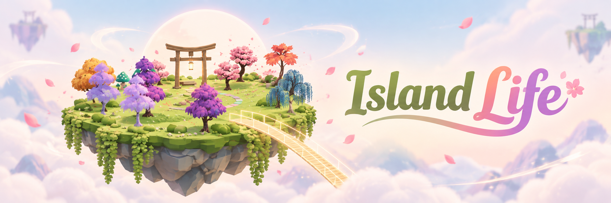</a>
  <br/><br/>
  <a href="docs/videos/hero.mp4">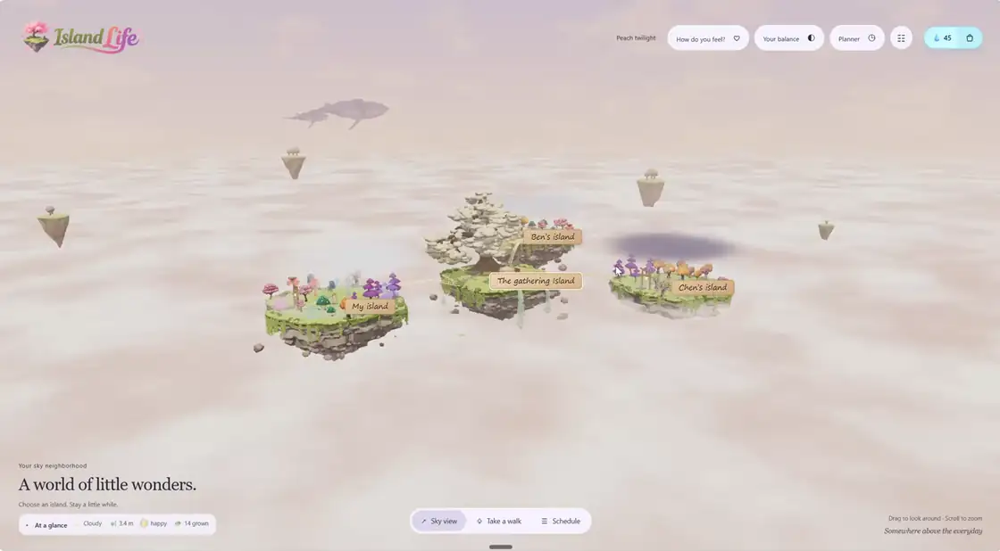</a>
  <br/><sub>Your sky neighbourhood, a full turn &nbsp;·&nbsp; <a href="docs/videos/hero.mp4">full clip</a></sub>
  <br/><br/>
  <a href="docs/videos/character.mp4">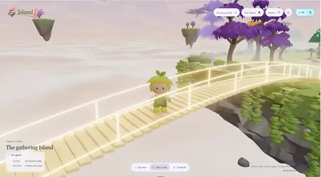</a>
  <br/><sub>Crossing to The Gathering Island &nbsp;·&nbsp; <a href="docs/videos/character.mp4">full clip</a></sub>
</p>

**Team:** Codenected  
**Team Members:** Lee Kai Hong, Leow Shen En, Choong Zhuo Lin, Chung Jun  
**Problem Statement:** Stress & Workload Manager

## Project Links

- **Video Presentation:** _To be added_
- **Presentation Slides:** _To be added_
- **Prototype:** [Island Life Prototype](https://island-life-one.vercel.app/)

## Island Life in 30 seconds

**Your week becomes an island.** The product turns a student's schedule, mood, and social support into a small 3D world that can be understood quickly.

|  | 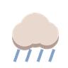 | 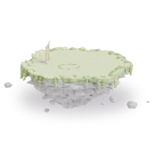 |  | 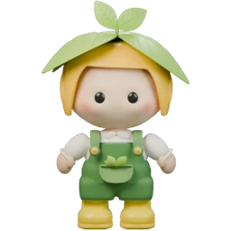 |
|:---:|:---:|:---:|:---:|:---:|
| Activities become trees | Mood becomes weather | Workload controls altitude | Friends connect without seeing your calendar | Your gardener avatar suggests rest when the week looks heavy |


# 1. Project Overview

## 1.1 Problem

Today’s university students are often overcommitted. A normal week can include:

- Demanding academics
- Co-curricular leadership
- Sports
- Part-time jobs
- Social lives

Saying **yes to everything** is how it starts. Students end up busy from morning to night, and still feel they have got nothing done.

Most productivity tools do not show that load very well:

- Standard **Pomodoro timers** count down time, but they do not know whether the student is tired, overloaded, or running out of room.
- Energy-tracking apps such as **Pensus** track useful signals, but the result often feels clinical: numbers, logs, and charts instead of something a student wants to return to.

That leaves three groups with a problem:

1. **Gen Z university students**
   - Need visual tools that feel personal.
   - Need better ways to manage their mental bandwidth.

2. **Peer groups**
   - Need a way to notice when a friend may be having a heavy week, without reading that friend's private schedule.

3. **University support networks**
   - Deal with the fallout when stress becomes a crisis.

**Island Life** shows that load instead. A student's week becomes a small floating island they can read in one glance, and friends can see when someone may need support without seeing a single entry in their calendar.


## 1.2 Our Solution

Island Life turns a student's week into a floating **3D island** that makes overload visible earlier.  

Island Life

- Converts scheduled commitments across **seven activity categories** into growing trees.
- Uses the island’s physical **altitude** to represent weekly workload density.
- Turns emotional check-ins into the island's **weather**.
- Uses a **gardener avatar** to suggest pre-scheduled, single-tap rest activities rather than enforcing rigid study marathons.
- Opens a daily **2-minute "Golden Window"** where friends share one unedited photo of what they are doing.
- Connects peer islands through **privacy-first bridges** that display emotional weather rather than private calendars.
- Replaces streak penalties with a guilt-free **"Let Go"** mechanic.
- Values and rewards **rest equally with work**.

Island Life makes a heavy week visible early, and makes doing something about it a single tap.


# 2. Ideation & Process

## 2.1 Ideas We Considered

These were the main ideas we tested, kept, changed, or dropped.

| Idea | Decision | Why |
|---|:---:|---|
| **Personalized 3D Island World (3D Sky Island)** | **Chosen** | A dashboard made the week feel like homework. A floating island let us show the same data physically: height for load, weather for mood, trees for planned time. |
| **1-Tap Photo Check-Ins ("The Golden Window")** | **Chosen** | We liked the honesty of BeReal: one quick photo of what is happening now. The photos sit on The Gathering Island carousel, so the group sees real moments instead of fake focus timers. |
| **Shared Peer Bridges & Gathering Island** | **Chosen** | Bridges gave the social part a shape. Friends can see weather, altitude, notes, and shared tasks, but not the private details of someone else's plan. |
| **AI-assisted gardener avatar** | **Chosen** | The gardener avatar watches mood check-ins and weekly load. In the prototype, it uses clear rules to suggest something small and already schedulable: tea, a walk, early sleep, or a slow evening. In a fuller version, AI would help classify calendar events and rank better activity ideas. |
| **Guilt-Free "Let Go" & Balanced Rewards** | **Chosen** | We did not want streaks or dead trees. If you let go of a task, its glass tree drifts away. Rest earns the same reward as studying: **Dewdrops 💧**. |
| **Visual Activity Trees & Timetable Clock Path** | **Chosen** | Each activity type became its own tree, so a study-heavy week looks different from a social-heavy one. Today's plan became a clock-face path with a light walking through it. |
| **Blender MCP Server Pipeline** | **Chosen** | We needed a lot of matching 3D assets quickly. Python scripts controlling Blender let us regenerate islands, trees, props, and renders after changes. |
| **Bee Colony & Honeycomb World** | **Dropped** | An alternative way to draw the same data: a honeycomb whose cells fill as the week fills, and nectar earned by turning up for the group. It mapped cleanly, but the team found it busier and more industrious than the floating island, and the calmer world suited an app about not overworking. |
| **One Mascot Per Member** | **Reshaped** | Early idea of a personal creature for each student. It became one gardener avatar who tends your island, with costumes kept back as a reward in the long-term plan, so the world stays readable rather than crowded. |
| **Forest-Style Single-Player Tree Planting** | **Dropped** | Forest depends on a timer, and a timer can reward someone for leaving a phone alone while doing nothing. Killing trees for stopping early also felt wrong for a burnout project. |
| **Crypto-Reward / Tokenomics Concept** | **Dropped** | Zach pushed us to drop it. Crypto rewards are common in hackathon pitches, add friction, and pull attention away from the wellness idea. |
| **Traditional Virtual Garden Concept** | **Dropped** | Zach also challenged the garden idea because it felt too familiar. The sky island kept the calm feeling but made the data clearer: altitude, weather, trees, and bridges each mean something. |
| **Audio Analysis & Automated AI Pathfinder** | **Dropped** | Audio tracking felt too invasive. We also did not want the app to pretend it knew the perfect schedule when mood and priority are easy to misread. |


## 2.2 Ideation Boards

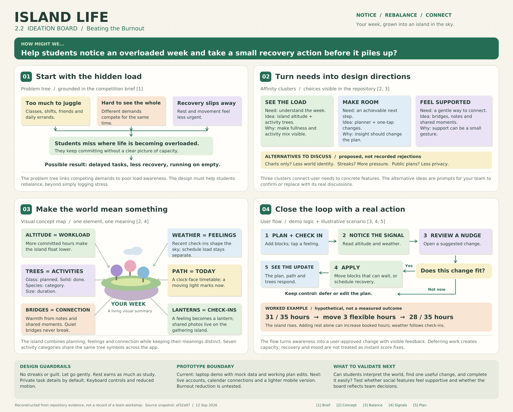


Our ideation process turns hidden workload into something students can see and act on. Island altitude, weather, trees, and bridges show workload, feelings, activities, and social support. Students notice overload early, while small changes still fix it.


## 2.3 How the Idea Evolved

The idea changed in stages. Each meeting helped us remove something, keep something, or make the product clearer.

<p align="left">
  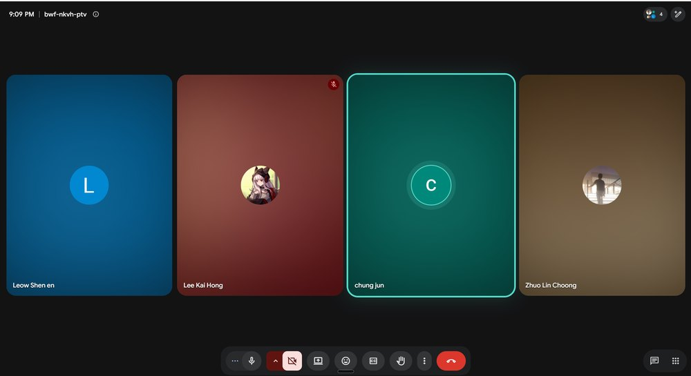
  <br/><sub>Leow Shen En, Lee Kai Hong, Chung Jun and Choong Zhuo Lin, on one of the working calls</sub>
</p>

### 1 September, first meeting: from a dashboard to a community

We started by breaking down the problem statement. The first ideas were simple: a timetable, a workload dashboard, and a chart of hours. They answered the brief, but felt too close to tools students already know.

The direction changed when **Chung Jun** suggested a BeReal-style check-in, where each member shares one photo of what they are actually doing. That made the product feel less like a private tracker and more like something a group could use together.

From there, we discussed group tasks, shared rewards, guide characters, and small rituals that happen at the same time for everyone. By the end of the meeting, two ideas were worth testing further:

- **Community support**, because friends can notice stress early.
- **A 3D world**, because workload is easier to understand when it has a visible shape.

### 5 September, mentorship: cutting what was generic

We took those ideas to the mentor session, which is recorded in 2.4. The main value of that session was narrowing the idea down. The virtual-garden and crypto-reward concepts felt too familiar, so we dropped them.

The BeReal-style check-in and the 3D world stayed. Zach also suggested using an MCP server to control Blender, which made custom 3D assets possible within the time we had.

That left one main question: if the product is a 3D world, what should the world show? A single tree growing on a timer was not enough.

### 7 September, second meeting: two worlds, one vote

**Choong Zhuo Lin** brought two possible world models. Both could carry real workload and mood data.

| | **Floating island** | **Bee colony** |
|---|---|---|
| Time and load | The island rises and sinks with the week | Honeycomb cells fill as the week fills |
| Activities | One tree species per kind of activity | Cells grouped by kind of work |
| Feelings | Weather over your own island | Colour of the hive |
| Community | Bridges to friends' islands | Nectar earned by showing up for the group |

Both models worked, but the island fit the product better. The bee colony felt too busy for an app about overwork. The island felt calmer, belonged clearly to one person, and still worked socially because separate islands can connect into a neighbourhood.

The mapping we chose that day is still the one in the product: **altitude is load, weather is feeling, trees are activities, bridges are friends.**

### 9 to 12 September, building: the decisions that shaped it

Thirty-six commits over three days. These were the main product decisions during the build.

| Decision | Why we made it | What we turned down |
|---|---|---|
| **Scripted asset generation** | Seven tree species, four islands, a character and every prop had to exist in three days and still look like one place. Python driving Blender means any of them can be regenerated after a change. | An asset pack, which would have looked like everyone else's, or modelling by hand, which we could not have finished. |
| **Manual completion** | A tree takes root only when you press Done. This is the whole difference from a timer that rewards a phone left face-down on a desk. | Growth on a schedule, which would have filled the island by itself and meant nothing. |
| **World-based onboarding** | The landing page is the world itself, with signposts you walk up to, so the first thing a student does is move rather than dismiss an overlay. | A tour or tooltip sequence, which most people skip anyway. |
| **Active rest reminder** | The rest suggestion first sat on a sign by the windmill, and a nudge that waits to be found is not a nudge. Your gardener avatar now speaks when you get home, and the sign keeps the offer. | A passive signpost, which would make the reminder too easy to miss when someone is already tired. |
| **User-confirmed scheduling** | Taking a suggestion used to put a slow evening on your plan at a time we chose. Now it offers free times, or hands you the planner. | Deciding someone's evening for them, which is the behaviour students already resent in productivity apps. |

## 2.4 Mentor Consultation

<p align="left">
  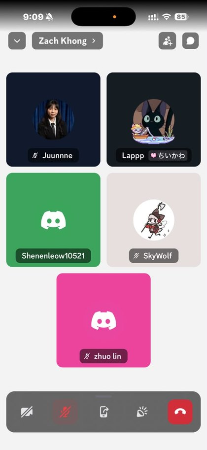
  <br/><sub>The session with Zach Khong, 5 September</sub>
</p>

| Date | Mentor | Feedback Received | What Was Changed |
|---|---|---|---|
| **5 Sept 2026** | **Zach Khong** | Zach told us the virtual garden and crypto reward ideas sounded too familiar. The parts he pushed us to keep were the BeReal-style photo check-in and the 3D island, because those gave the project a clearer social and visual identity. He also suggested driving Blender through an **MCP server**, then rendering the result in **Three.js**, so we could make custom assets without modelling everything by hand. | We dropped the crypto and generic garden directions. The product became a set of connected sky islands instead of a single-player task garden. We used Blender scripts for the island, trees, gardener, props, and renders, then used **Three.js** in the browser. We also studied **Opal**, **Operator/Uplift**, **Pensus**, and Pomodoro tools, mainly to decide what to avoid: fake timers, guilt loops, dry logs, and schedules that pretend to know too much. |


# 3. Design & Prototype

## 3.1 Prototype

**Live Prototype:**  
[https://island-life-one.vercel.app/](https://island-life-one.vercel.app/)


---

### Your week, as an island

<table>
<tr>
<td width="50%"><a href="docs/videos/trees.mp4">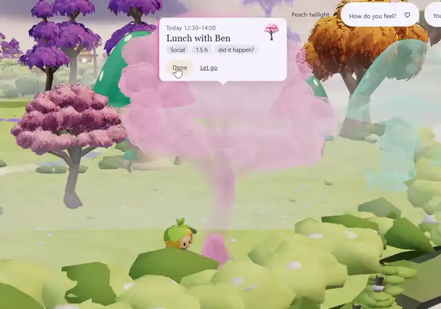</a><br/><sub>Mark it done, and the glass tree takes root &nbsp;·&nbsp; <a href="docs/videos/trees.mp4">full clip</a></sub></td>
<td width="50%"><a href="docs/videos/sinking.mp4">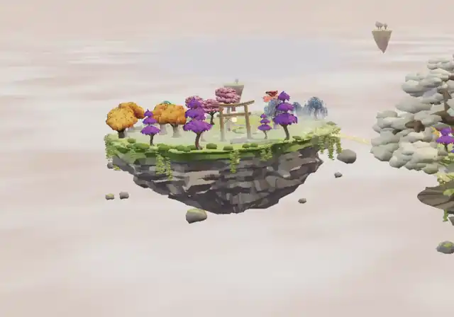</a><br/><sub>The island sinks as the week fills up &nbsp;·&nbsp; <a href="docs/videos/sinking.mp4">full clip</a></sub></td>
</tr>
<tr>
<td valign="top"><h3>Everything you do grows into a tree</h3>
Seven kinds of activity, seven kinds of tree. What's coming up stands as a glass tree. Mark it done, and it takes root in full colour. Let it go, and the glass tree drifts away quietly.</td>
<td valign="top"><h3>A full week sinks your island</h3>
Your island floats high when your week has room, and sinks toward the clouds as you take more on. You feel it's too much before you've said yes to one more thing.</td>
</tr>
<tr>
<td><a href="docs/videos/weather.mp4">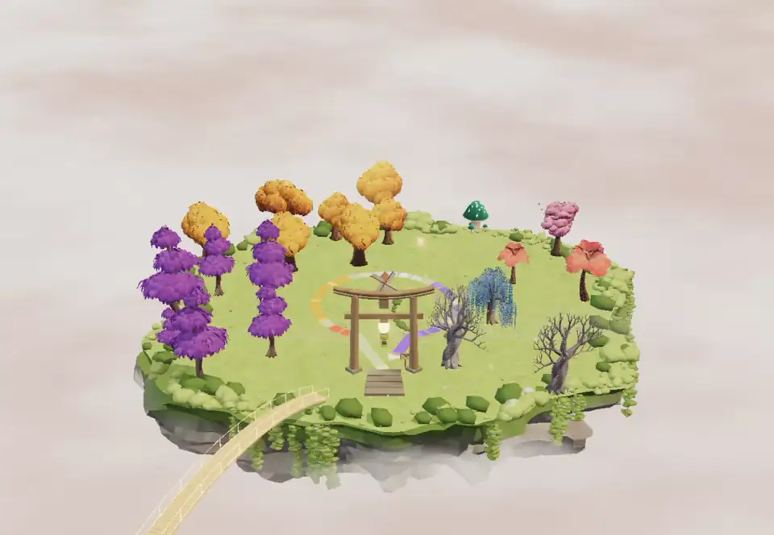</a><br/><sub>Heavy days gather cloud, then rain &nbsp;·&nbsp; <a href="docs/videos/weather.mp4">full clip</a></sub></td>
<td><a href="docs/videos/visiting_friend.mp4">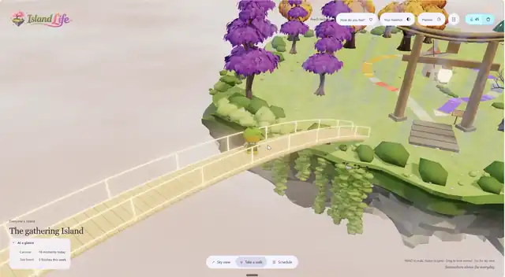</a><br/><sub>Cross a bridge to a friend's island &nbsp;·&nbsp; <a href="docs/videos/visiting_friend.mp4">full clip</a></sub></td>
</tr>
<tr>
<td valign="top"><h3>Your feelings become the weather</h3>
Tell your island how you feel, and a coloured lantern rises into its sky. A few tired, stressed or low days gather cloud, then rain. Calm and happy days clear it again.</td>
<td valign="top"><h3>Your friends are a bridge away</h3>
Friends' islands connect to yours through The Gathering Island. You see their weather and how high they float, never their hours or plans. A rainy island is your cue to leave a note at their gate.</td>
</tr>
</table>

|  |  |  |  |  |  |  |
|:---:|:---:|:---:|:---:|:---:|:---:|:---:|
| Study | Work | Errands | Social | Exercise | Rest | Other |

The same little trees mark each kind of activity everywhere in the app, so you can spot a study-heavy week from across the sky.

**How you feel** hangs as a lantern in your island's sky, one colour per feeling.

|  |  |  |  |  |
|:---:|:---:|:---:|:---:|:---:|
| Calm | Happy | Tired | Stressed | Low |

**Your sky** then clouds over or clears, following those lanterns across the week.

|  |  |  |  |  |
|:---:|:---:|:---:|:---:|:---:|
| Clear | Light cloud | Cloudy | Drizzle | Rain |

---

### A nudge before you burn out

Burnout creeps up, so Island Life watches for it. When your check-ins keep coming back tired, stressed or low, or your week gets too full, it nudges you on its own, with a way to unwind picked from your own week.

<table>
<tr>
<td width="50%"><a href="docs/videos/nudge.mp4">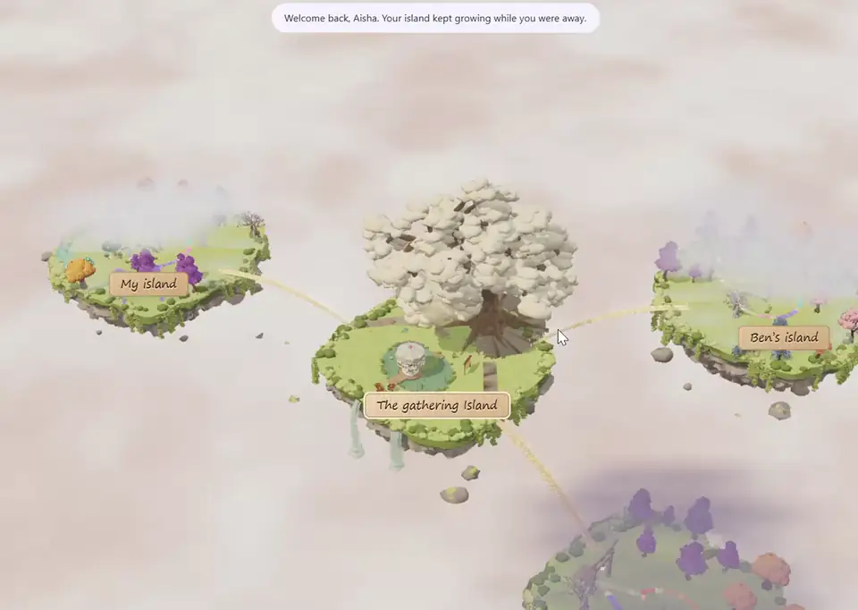</a><br/><sub>Your gardener avatar speaks up, and you pick a time &nbsp;·&nbsp; <a href="docs/videos/nudge.mp4">full clip</a></sub></td>
<td width="50%">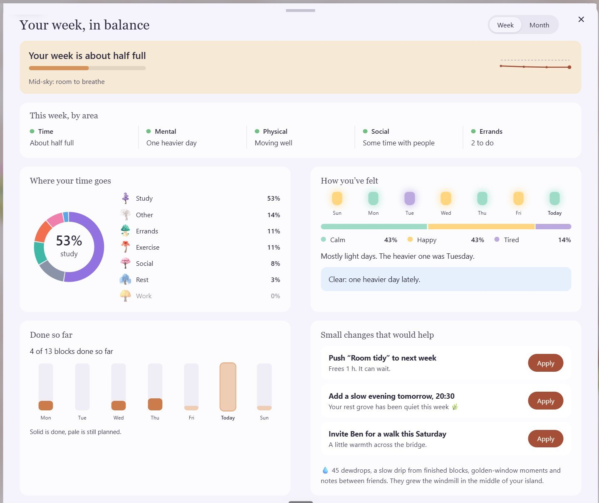</td>
</tr>
<tr>
<td valign="top"><b>Your gardener avatar speaks up.</b> After a run of tired, stressed or low days, your gardener notices the moment you get home and suggests a way to unwind: tea with the friend you've seen least, a walk if you've barely moved, an early night after late ones, or a slow evening. It has already found a free time. One tap puts it on your plan, or ask for another idea.</td>
<td valign="top"><b>The analysis page.</b> Time, mental, physical, social and errands, each read from your week and put in plain words. Next to them are changes made for you, like pushing the two blocks you marked "can wait" to next week. Each one applies in one tap.</td>
</tr>
</table>

---

### And the little moments

<table>
<tr>
<td>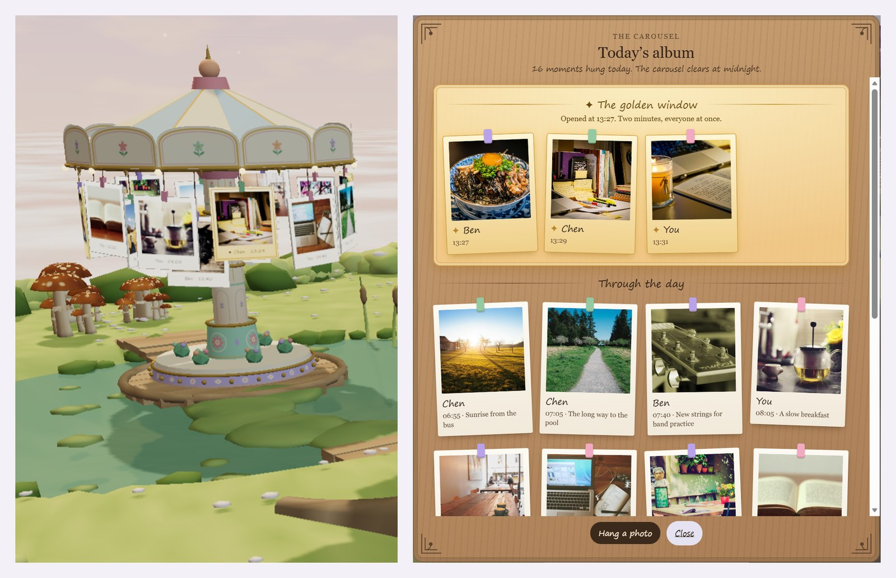</td>
<td>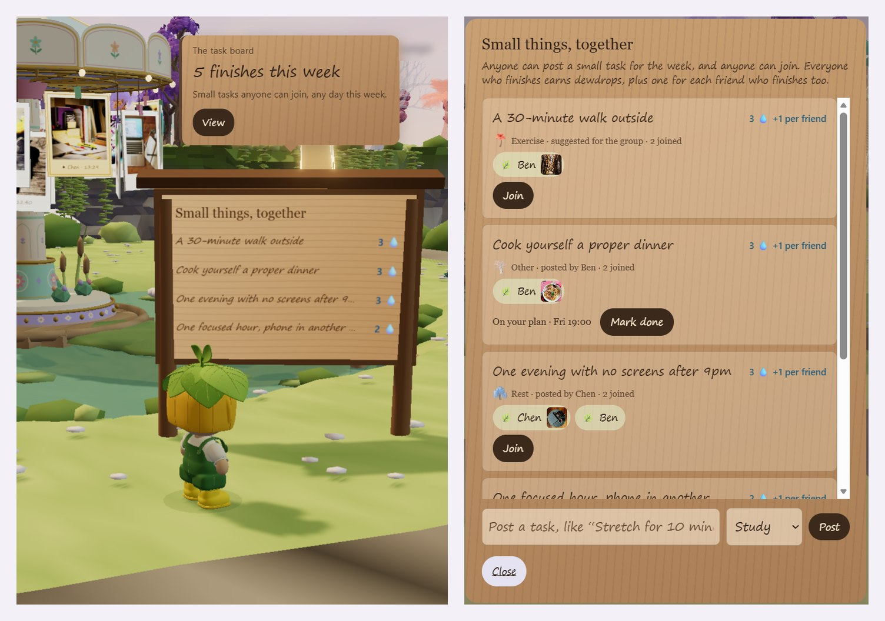</td>
</tr>
<tr>
<td valign="top"><b>The golden window.</b> Once a day, everyone gets two minutes to share one photo of right now. The photos hang on the carousel on The Gathering Island, and the day's album keeps them all.</td>
<td valign="top"><b>Small things, together.</b> Anyone can post a small task, like a walk outside or an evening with no screens. You earn more when friends finish too.</td>
</tr>
</table>

- **Today is a path.** Your day is a glowing path laid out like a clock face, and a little light walks it in real time.
- **Notes wait at your gate.** Friends leave a few words on a wooden sign, and you read them when you get home.
- **A planner that feels normal.** Day, week and month views, with drag to add and move, Done, and a guilt-free Let go.
- **Dewdrops.** Small rewards for finishing things, resting and showing up for friends. You spend them on garden props and lanterns.


### Design choices

- **No streaks, no guilt.** Letting go of a plan is fine. Its glass tree drifts away and stops counting this week. You can bring it back any time.
- **It rewards balance, not hustle.** A finished rest block earns the same as a finished study block.
- **Private by default.** Friends see your weather and how high you float, in words. Your hours, plans and check-ins stay yours. For each block, you choose whether friends see the whole thing, only its kind and size, or nothing.


## 3.2 How it works

Every part of the world is driven by something the student did, not by decoration.

<details>
<summary><b>The full mapping, element by element</b></summary>

| In the world | What it means | What drives it |
|---|---|---|
| **Altitude** | How full your week is | Planned hours this week against what you can give. Very full weeks sit just above the cloud sea. |
| **Weather** | How you've been feeling | Your check-ins this week, with recent days counting for more. Tired, stressed and low bring cloud and rain. Calm and happy clear it. |
| **Glass trees** | What's coming up | Future blocks, one species per kind of activity |
| **Solid trees** | What you did | A block you marked Done. Nothing grows on its own. |
| **Glowing path** | Today's timetable | Your blocks from 07:00 to 22:00, laid out like a clock face |
| **The light on the path** | Right now | It walks the path in real time |
| **Lanterns in your sky** | Your feelings | Each check-in you make this week |
| **Bridge glow** | Warmth with your friends | Notes, shared moments and time together |
| **Carousel photos** | The day's shared moments | One photo per person from the golden window, plus moments through the day |
| **Dewdrops** 💧 | A gentle reward | Done blocks, notes, moments and group tasks |

</details>

**Rebalancing a heavy week is a loop.** The student sees the week, the app points out what is too much, the student changes it, and the island shows the result.

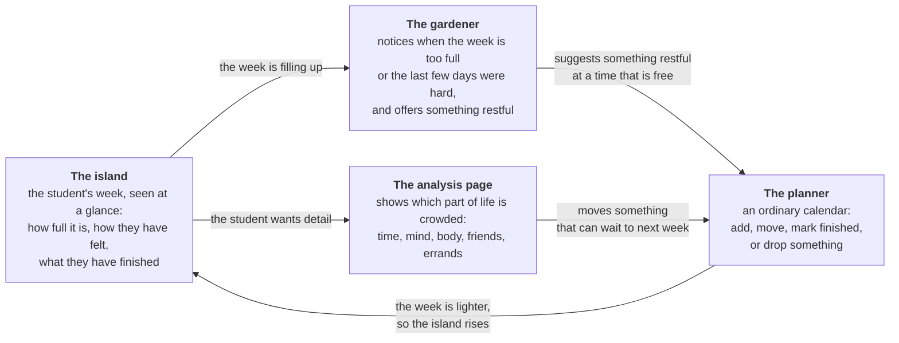

# 4. What Makes It Different

Island Life differs in three ways: the week is read as a **3D place** rather than a chart, the island **speaks up when the week looks heavy**, and friends see **how you are without seeing your calendar**.

## Competitive Comparison

| Feature | **Island Life** | **Forest** | **Pensus** | **Pomodoro** | **Operator Uplift** |
|---|---|---|---|---|---|
| **World and visuals** | A 3D island in Three.js. Its height, light, trees, bridges, and weather change with the week. | A top-down 2D forest grid. | Dashboards with numbers, rings, and charts. | A timer, usually with a countdown or progress bar. | Workspace screens with task logs, lists, and feeds. |
| **Optional Photo Check-In** | **1-Tap Photo Check-In.** Share a photo of any moment on the group's carousel, whenever you like. Once a day, BeReal-style, a two-minute golden window opens for everyone at once. Sharing is optional. | Passive countdown timer. Trees grow even if the phone sits idle on a desk while the user watches TV or sleeps. | Mechanical background timer, with nothing shared with anyone. | Mechanical background timer, with nothing shared with anyone. | Mechanical background timer, with nothing shared with anyone. |
| **Burnout and rest** | The gardener avatar watches for heavy weeks or repeated tired, stressed, and low check-ins. Rest can be added in one tap and earns **Dewdrops 💧** too. | Stopping early can kill a tree, which can make a bad study day feel worse. | Tracks energy, but mostly shows it as logs and metrics. | Uses fixed 25/5-minute intervals, even when the student needs a different rhythm. | Focuses on task execution and planning, not emotional load. |
| **Friends** | Friends visit through bridges, see weather and altitude, leave gate notes, and finish small group tasks together. Private calendar details stay hidden. | Mostly single-player. Shared rooms mainly synchronize a timer. | No built-in social space. | No built-in social space. | Team feeds and shared workspaces, built more for work than student wellbeing. |


# 5. Technical Architecture & Feasibility


## 5.1 Tech Stack

Island Life is currently a **browser-based visual prototype**. The frontend renders the 3D world and keeps demo data locally. For production, Supabase would handle accounts, storage, real-time friend updates, and server-side work that should not run in the browser.

The demo works on **rule-based calculation**: altitude, weather, tree species and rest suggestions are plain functions anyone can read. In the building phase before the final we add an **LLM** for the parts a model is genuinely better at, naming the kind of activity behind a calendar entry, putting a heavy week into plain words, and drafting rest ideas. The rules still decide what happens, and nothing reaches a student's plan until they tap it.
```
Frontend: HTML5 + CSS3 + JavaScript + Three.js + Vite
Backend: Supabase Auth + Data API + Realtime + Edge Functions + Cron
Database: PostgreSQL with Row-Level Security
Storage: Supabase Storage
Integrations: Google Calendar API + Microsoft Graph + ICS + CalDAV
Deployment: Vercel + Supabase
Testing: Playwright + Node.js Test Runner
Asset pipeline: Blender + Python + GLB/glTF
```

### Frontend

| Technology | Role | Reason for Selection | Status |
|---|---|---|---|
| **HTML5** | Defines the interface: navigation, planner sheets, forms, dialogs, and accessibility labels. | The project does not need a UI framework for the demo, and plain HTML keeps the screens easy to inspect. | In the current demo |
| **CSS3** | Handles responsive layout, visual styling, transitions, animations, and reduced-motion behaviour. | Native CSS gives us enough control for the painterly interface around the 3D world. | In the current demo |
| **JavaScript with ES Modules** | Runs the planner, mood check-ins, social actions, rewards, and Three.js scene updates. | ES modules let us split the prototype into focused files while still running directly in the browser. | In the current demo |
| **Rule-based logic** | Reads simple signals: mood check-ins, how long each activity takes, how many hours are planned, and how mixed the week is. From those it works out the island's altitude, its weather, and which rest idea to offer. | Rules are enough for counting and comparing, and they can be read and tested. | In the current demo |
| **Three.js** | Renders the islands, trees, bridges, weather, timetable path, character, lighting, and post-processing. | Three.js handles the WebGL work for us, and it can load the GLB files we export from Blender. | In the current demo |
| **GLTFLoader** | Loads the island, tree, character, and decoration models into the scene. | GLB/glTF keeps the models compact and carries across the geometry, materials, and textures we need. | In the current demo |
| **OrbitControls** | Lets users rotate and zoom the camera around the islands and player. | The controls already feel familiar on mouse and touch, so we did not have to build that layer ourselves. | In the current demo |
| **EffectComposer and UnrealBloomPass** | Adds bloom to paths, bridges, lanterns, and atmospheric lighting. | The glow is part of the visual language, especially for the bridge and timetable path. | In the current demo |
| **Browser Media APIs** | Opens the user's camera or uploaded images for mood lanterns and community moments. | The browser already has the capture tools we need for the prototype. | In the current demo |
| **Vite** | Runs the local dev server, handles ES modules, and builds the production bundle. | It starts quickly and fits a plain JavaScript and Three.js project. | In the current demo |

### 3D Asset Production

| Technology | Role | Reason for Selection | Status |
|---|---|---|---|
| **Blender** | Creates the islands, trees, gardener character, decorations, and rendered interface artwork. | It gives us modelling, materials, lighting, animation, and GLB export in one tool. | In the current demo |
| **Python** | Generates Blender models, renders, inspections, and exports. | Scripts keep the assets repeatable. If a tree shape changes, we can rebuild the set instead of fixing each file by hand. | In the current demo |
| **GLB/glTF, WebP, PNG, and JPEG** | Deliver 3D models, icons, character sprites, artwork, and photographs. | These formats work across modern browsers and keep file sizes reasonable for the demo. | In the current demo |

### Proposed Backend and Database

| Technology | Role | Reason for Selection | Status |
|---|---|---|---|
| **Supabase** | Backend platform for the production version. | It gives the team Postgres, auth, storage, realtime, APIs, and edge functions without running separate services for each one. | Planned for the final |
| **PostgreSQL** | Stores profiles, friendships, blocks, recurrences, check-ins, notes, shared tasks, rewards, moments, and calendar metadata. | The data is relational: friends connect to profiles, blocks create weekly load, and privacy rules depend on who is asking. | Planned for the final |
| **Supabase Auth** | Handles registration, login, password recovery, sessions, and Google OAuth. | Auth records can link directly to profile rows and database policies. | Planned for the final |
| **Row-Level Security (RLS)** | Keeps private schedules and mood records visible only to the owner. | Friend views should come from permitted summary values, not accidental access to raw calendar rows. | Planned for the final |
| **Supabase Data API** | Lets the browser read and write approved database rows. | The client library fits the current JavaScript code and avoids a separate CRUD API at the first production stage. | Planned for the final |
| **Supabase Realtime** | Updates friend status, notes, shared tasks, community photos, and derived island changes between users. | Friend islands should change while people are using the app, without asking them to refresh. | Planned for the final |
| **Supabase Storage** | Stores profile images, mood photos, and golden-window submissions. | These files need the same account-based privacy as the rest of the product. | Planned for the final |
| **Supabase Edge Functions** | Runs calendar OAuth, calendar API calls, notifications, and other privileged work. | API secrets and refresh tokens should stay on the server. | Planned for the final |
| **Supabase Cron** | Runs scheduled calendar sync, recovery nudges, and the daily golden window. | Those jobs need to happen even when nobody has the app open. | Planned for the final |

### APIs and External Services

| Technology | Role | Reason for Selection | Status |
|---|---|---|---|
| **Google Calendar API** | Imports Google Calendar events, with updates planned later. | Many students already keep classes and deadlines there, including repeating events. | Planned for the final |
| **Microsoft Graph Calendar API** | Connects Outlook, Microsoft 365, and supported university calendars. | This matters for schools that run on Microsoft 365. | Planned for the final |
| **ICS Calendar Feeds** | Imports classes, coursework, and deadlines from Canvas, Moodle, Blackboard, and similar systems. | ICS links are common and do not require app approval, which makes them a practical first import path. | Planned for the final |
| **CalDAV** | Leaves room for iCloud Calendar and other compatible calendars later. | It is useful for broader calendar support after the final. | Planned for the final |
| **Google Classroom API** | Imports coursework due dates from Google Classroom. | Some coursework never reaches the student's personal calendar. | Planned for the final |
| **External LLM API** | Helps map calendar entries to the app's activity kinds, and suggests rest based on what the student has been doing lately. The student can correct it, and nothing is added to a plan until they tap it. | Reading messy event titles and wording a suggestion are what a model does well. | Planned for the final |

### Hosting, Testing, and Delivery

| Technology | Role | Reason for Selection | Status |
|---|---|---|---|
| **Vercel** | Hosts the Vite frontend and preview deployments. | The built site is static, so Vercel is a simple fit for the demo and final deployment. | In the current demo |
| **Playwright** | Tests login flows, planner interactions, keyboard controls, dialogs, and browser rendering. | It runs the same flows a judge or student would click through in a real browser. | In the current demo |
| **Node.js Test Runner** | Runs unit tests for workload, altitude, weather, recurrence, and reward calculations. | Node already includes it, so we can test the core logic without adding another framework. | Planned for the final |
| **GitHub and GitHub Actions** | Handles source control, builds, and test runs. | The repo is already on GitHub; Actions would let every push run the same checks. | GitHub in use, Actions planned for the final |


---

## 5.2 System Architecture
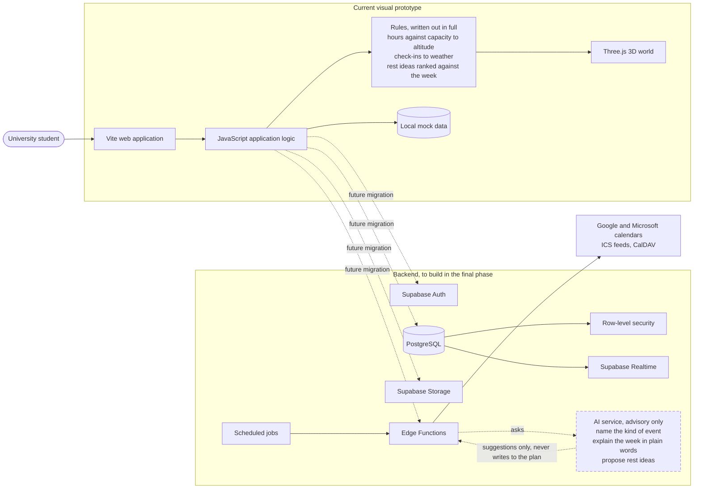

<sub>Source: <a href="docs/architecture.mmd">docs/architecture.mmd</a>. The rules box is the part that decides anything today, and it is plain code rather than a model. The AI service is dashed because it is planned, and it only ever advises.</sub>
## 5.3 Build Plan for the Final

The plan follows the competition's own phases. The order is deliberate: import proves the idea on a judge's own timetable, accounts make a demo survive a refresh, and the phone is where a student would actually keep it open.

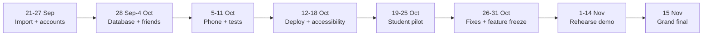

| Window | Focus |
|---|---|
| **21 Sep to 11 Oct** | Building: turn the prototype into something a stranger can use with their own week |
| **12 Oct to 31 Oct** | Deploy: make it fast, reachable, and tested by people who are not us |
| **1 Nov to 14 Nov** | Rehearse: fix what the pilot found and make the demo dependable |
| **15 Nov** | Grand final |

### Building, 21 September to 11 October

| Week | What we build | Done when |
|---|---|---|
| **21 to 27 Sep** | **Timetable import.** Parse an ICS feed, turn each event into a block, expand weekly repeats, and guess a category from the event title with a manual override. Store the link so it can be refreshed. | A pasted Canvas, Moodle or Google link fills a week on the island, and re-importing does not create duplicates. |
| | **Database and accounts.** Supabase project, schema for profiles, blocks, check-ins, notes, tasks and moments, row-level security, email and Google sign-in. | A signed-in student reads and writes only their own rows, proven by a failing query from another account. |
| **28 Sep to 4 Oct** | **Plans move to the database.** The existing plan store reads and writes Postgres instead of mock data, with the interface updating immediately and reconciling after. | Add, move, finish and let go survive a refresh and appear on a second device. |
| | **Friends for real.** Invite by link, a friendship table, and friend-facing values derived on the server so hours and titles never leave the owner's account. | A friend sees weather and altitude in words, and a direct query for anything else returns nothing. |
| | **Import in the planner.** The sync panel stops being a demo: paste a link, preview what will arrive, choose which calendars to keep. | A student can import, see what changed, and undo it. |
| **5 to 11 Oct** | **Phone pass.** One-thumb movement, larger touch targets, sheets and the island card laid out for a narrow screen, and a lighter quality tier for weaker devices. | The full flow works on a mid-range Android phone at a steady frame rate. |
| | **Lighter world.** Compressed meshes and textures, and islands loaded as they are needed rather than all at once. | First meaningful view under five seconds on a normal connection. |
| | **Tests.** Unit tests for load, altitude, weather and recurrence; Playwright for sign-in, import, planner and the nudge. | The suite runs on every push and blocks a broken merge. |

### Deploy, 12 October to 31 October

| Week | What we do | Done when |
|---|---|---|
| **12 to 18 Oct** | **Production deploy.** Vercel with the Supabase production project behind it, environment separation, backups, and error reporting. | A clean install from the public URL works with no local setup. |
| | **Performance and accessibility.** First-load budget, keyboard path through every screen, visible focus, contrast, reduced motion, and Safari, Firefox and Chrome on desktop and phone. | Every task can be completed without a mouse, and the world holds a steady frame rate on the phones we have. |
| **19 to 25 Oct** | **Pilot with students outside the team.** Around ten of them for a week: import a timetable, check in daily, meet one nudge. We watch the first five minutes without explaining anything. | We can say what people misunderstood, and how many imported, marked something done, and accepted a suggestion. |
| **26 to 31 Oct** | **Fix what the pilot found**, then harden the edges: first run with nothing on the plan, an import that fails, a friend who never checks in, and an offline start. | The top issues from the pilot are closed, and no empty state is a blank screen. |
| | **Feature freeze** on 31 October. | Only fixes after this date. |

### Rehearse, 1 to 14 November

A demo that runs from a judge's own calendar link, a recorded fallback in case the network fails, and a five-minute script: import a real timetable, watch the island sink, let the gardener avatar catch it.

### Risks we are planning around

| Risk | What we do about it |
|---|---|
| Google and Microsoft sign-in approval takes weeks | The final depends on ICS links, which need no approval. Two-way sync stays after the final. |
| A 3D world is heavy on cheap phones | A lighter quality tier and compressed assets in the building phase, tested on a mid-range device rather than ours. |
| Nobody outside the team has used it | The pilot is scheduled inside the deploy window, not left until the end. |
| A live demo depends on the venue network | The fallback runs on local data with no network at all. |

## 5.4 Beyond the Final

- **Two-way calendar sync** with Google Calendar and Microsoft Graph, so a slow evening added on the island travels back to the calendar it came from.
- **Live weather between friends**, updating as check-ins land rather than at the next reload.
- **Gentle milestones**, such as a first week in balance or a first slow evening.
- **Island decorations and gardener avatar costumes**, bought with dewdrops, cosmetic only, and earned as easily by resting as by studying.

# Summary

**Island Life** is a stress and workload manager that reads as a place rather than a dashboard.

Instead of another timer or checklist, it puts a student's schedule, workload, feelings and rest into one small **3D island** they can see.

The goal is not to help students **do more**. It is to help them see when they are doing **too much**, and to make the next small step easy.

<div align="center">
  <strong>Made by Team Codenected</strong>
  <br>
  <strong><em>© Codenection 2026</em></strong>
</div>
